# مخطط قاعدة البيانات — منصة كفاءات

> تقرير تدقيق (قراءة فقط) — التاريخ: **2026-07-20**.
> المصدر: 95 ملف هجرة في `database/migrations/` + مخطط قاعدة التطوير الفعلية `database/database.sqlite` (تم استخراجه عبر `sqlite3 .schema`). القاعدة مُهجَّرة بالكامل (`migrate:status` = جميعها `Ran`). القاعدة الافتراضية `sqlite`، والإنتاج `pgsql`.

الأنواع أدناه كما ظهرت في SQLite؛ في PostgreSQL تُترجم إلى ما يقابلها (`varchar`, `text`, `integer`, `boolean`, `timestamp`, `date`, `numeric`, `jsonb`). الأعمدة النصية المخزِّنة لبيانات JSON (مثل `weekdays`, `session_topics`, `metadata`, `notification_settings`) هي `text` في SQLite و`json/jsonb` في Postgres، وتُحوَّل عبر `casts` في النماذج.

---

## 1. مخطط علائقي مبسّط (ER)

```mermaid
erDiagram
    users ||--o| profiles : "hasOne"
    users ||--o{ program_registrations : "hasMany"
    users ||--o{ path_registrations : "hasMany"
    users ||--o{ volunteer_registrations : "hasMany"
    users ||--o{ volunteer_hours : "hasMany"
    users ||--o{ certificates : "hasMany"
    users ||--o{ in_app_notifications : "hasMany"
    users ||--o{ privacy_requests : "hasMany"
    users ||--o| candidate_pool_preferences : "hasOne"
    users ||--o{ user_documents : "hasMany"

    training_programs ||--o{ program_registrations : "hasMany"
    training_programs }o--o| learning_paths : "belongsTo"
    training_programs ||--o{ program_attendance_checkers : "hasMany"
    program_registrations ||--o{ program_attendance : "hasMany"

    learning_paths ||--o{ path_registrations : "hasMany"
    path_registrations ||--o{ path_attendance : "hasMany"

    volunteer_opportunities ||--o{ volunteer_registrations : "hasMany"
    volunteer_opportunities ||--o{ volunteer_hours : "hasMany"

    volunteer_teams ||--o{ team_members : "hasMany"
    volunteer_teams ||--o{ team_notifications : "hasMany"

    news ||--o{ news_images : "hasMany"

    privacy_requests ||--o{ privacy_request_events : "hasMany"
    privacy_requests ||--o| data_deletion_plans : "hasOne"
    privacy_requests ||--o| privacy_export_files : "hasOne"
    data_deletion_plans ||--o{ data_deletion_plan_steps : "hasMany"

    retention_policies ||--o{ retention_runs : "hasMany"
    retention_runs ||--o{ retention_run_items : "hasMany"

    certificates }o--|| users : "belongsTo"
    certificates ||..|| certificateable : "morphTo (program/path/volunteer)"
```

---

## 2. الجداول حسب المجال

اختصارات: **PK** = مفتاح أساسي، **FK** = مفتاح خارجي، **U** = فريد.

### 2.1 المصادقة والمستخدمون

#### `users`
| العمود | النوع | ملاحظات |
| --- | --- | --- |
| id | integer | PK |
| name | varchar | الاسم القديم (توافقية) |
| first_name, father_name, grandfather_name, family_name | varchar nullable | الاسم المنظَّم (Phase Identity) |
| email | varchar | **U** |
| email_verified_at | datetime | |
| password | varchar | hashed |
| remember_token | varchar | |
| role_type | varchar | افتراضي `beneficiary` — **نظام أدوار موازٍ** لـ Spatie |
| phone | varchar | |
| staff_photo | varchar | صورة الموظف (قرص public) |
| is_active | boolean | افتراضي 1 |
| last_login_at | datetime | |
| notify_email | boolean | افتراضي 0 |
| notification_prefs_set_at | datetime | إظهار نافذة التفضيلات مرة واحدة |
| notification_settings | text(json) | cast: array |
| identity_type | varchar | enum IdentityType |
| identity_number_ciphertext | text | **رقم الهوية مشفّر** (hidden) |
| identity_number_lookup_hash | varchar | **U** — HMAC للبحث عن التكرار (hidden) |
| identity_number_last4 | varchar | آخر 4 أرقام (للعرض المقنّع) |
| identity_confirmed_at | datetime | |
| profile_completed_at | datetime | |
| account_status | varchar | enum AccountStatus (`active`/`inactive`/`deletion_pending`/`deletion_processing`/`anonymized`) |
| privacy_deleted_at, anonymized_at | datetime | |
| deletion_request_id | integer | **FK → privacy_requests** (set null) |
| created_at, updated_at | datetime | |

فهارس: `users_email_unique`, `users_identity_number_lookup_hash_unique`, `(identity_type, identity_number_last4)`.

#### `profiles` (hasOne من users)
`id` PK · `user_id` FK→users (restrict) · `gender` · `birth_date` · `city` · `bio` · `avatar` · `membership_badges`(text) · `iconic_skill_style` · `iconic_skill` · `job_title` · `competency_levels`(text) · `cv_sections`(text) · `cv_sections_visibility`(text) · `cv_language`(افتراضي `ar`) · `cv_path` · `current_cv_document_id` FK→user_documents(set null) · `membership_type`(افتراضي `beneficiary`).

#### `email_verification_codes`
`id` · `user_id` FK→users **U** · `code_hash` · `attempts` · `expires_at`. (رمز OTP بريدي).

#### جداول إطار العمل
`sessions`, `password_reset_tokens`, `cache`, `cache_locks`, `jobs`, `job_batches`, `failed_jobs`, `migrations`.

#### Spatie
`permissions`, `roles`, `model_has_permissions`, `model_has_roles`, `role_has_permissions` — انظر `USER_ROLES_AND_PERMISSIONS.md`.

---

### 2.2 التدريب والمسارات

#### `learning_paths`
`id` · `title` · `slug`(U) · `description` · `capacity` · `status`(افتراضي `draft`) · `published_at` · `image` · `owner_id` FK→users · `path_kind`(افتراضي `training_path`) · `auto_accept_registrations` · `notify_on_publish` · `competency_track` · `created_by`/`updated_by` FK→users.

#### `training_programs`
`id` · `title` · `slug`(U) · `description` · `capacity` · `start_date`/`end_date` · `registration_start`/`registration_end` · `status`(`draft`) · `published_at` · `learning_path_id` FK→learning_paths(set null) · `weekdays`(text/json) · `image` · `program_kind`(افتراضي `course`) · `assigned_to` FK→users · `path_sort_order` · `owner_id` FK→users · `auto_accept_registrations` · `notify_on_publish`/`notify_milestones`/`notify_registrants_on_update` · `competency_track` · `delivery_mode` · `venue` · `session_topics_enabled` + `session_topics`(text/json) · `whatsapp_groups_enabled` + `whatsapp_group_male`/`whatsapp_group_female` · `acceptance_conditions`(text/json) · `program_presenters`(text/json) · `created_by`/`updated_by`.

#### `program_registrations`
`id` · `training_program_id` FK(cascade) · `user_id` FK(restrict) · `status`(`pending`) · `approved_by` · `approved_at` · `rejected_reason` · `attendance_percentage`(numeric, 0) · `score`(numeric). **U**(`training_program_id`,`user_id`).

#### `path_registrations`
مثل السابق لكن `learning_path_id` + عمودا `completed_at`, `attendance_percentage`, `score`. **U**(`learning_path_id`,`user_id`).

#### `program_attendance`
`id` · `program_registration_id` FK(cascade) · `training_date`(date) · `status`(`absent`) · `notes`. **U**(`program_registration_id`,`training_date`).

#### `path_attendance`
مثل السابق لكن `path_registration_id` + `attendance_date`. **U**(`path_registration_id`,`attendance_date`).

#### `attendance_live_sessions`
`id` · **morph** `attendable_type`/`attendable_id` · `created_by` FK→users · `started_at` · `expires_at`. (جلسة رمز حضور حي مؤقتة لبرنامج/مسار).

#### `program_attendance_checkers`
`id` · `training_program_id` FK(cascade) · `name` · `email` · `invite_code_hash` · `invite_code_expires_at` · `invite_attempts` · `verified_at` · `is_active`. **U**(`training_program_id`,`email`). (مسؤولو تحضير مدعوّون عبر بوابة `/gate`).

#### جداول محرِّرين (Pivot، بلا نموذج مستقل)
- `training_program_editors` (`training_program_id`,`user_id`) **U**.
- `learning_path_editors` (`learning_path_id`,`user_id`) **U**.

---

### 2.3 التطوع

- **`volunteer_opportunities`**: `id` · `title` · `slug`(U) · `description` · `capacity` · `hours_expected`(numeric) · `start_date`/`end_date` · `status`(`draft`) · `published_at` · `assigned_to` FK→users · `image` · `notify_on_publish`/`notify_registrants_on_update` · `created_by`/`updated_by`.
- **`volunteer_registrations`**: `opportunity_id` FK(cascade) · `user_id` FK(restrict) · `status`(`pending`) · `approved_by`/`approved_at`/`rejected_reason`. **U**(`opportunity_id`,`user_id`).
- **`volunteer_hours`**: `user_id` FK(restrict) · `opportunity_id` FK(set null) · `hours`(numeric) · `status`(`pending`) · `approved_by`/`approved_at` · `notes`.
- **`volunteer_teams`**: `name` · `slug`(U) · `description` · `is_active` · `assigned_to`/`created_by`.
- **`team_members`**: `volunteer_team_id` FK(cascade) · `user_id` FK(restrict). **U**(معاً). (Pivot له نموذج `TeamMember` + علاقة `belongsToMany`).
- **`team_notifications`**: `volunteer_team_id` FK(cascade) · `title` · `body` · `published_at` · `created_by`.

---

### 2.4 الشهادات والملف الشخصي

- **`certificates`**: `user_id` FK(restrict) · **morph** `certificateable_type`/`certificateable_id` (برنامج/مسار/فرصة) · `certificate_number`(U) · `verification_code`(U) · `file_path` · `issued_at`. فهارس على الحقلين المورفيين والمستخدم.
- **`profile_recommendations`**: `user_id` FK(restrict) · `author_name` · `author_title` · `body` · `sort_order`.

---

### 2.5 المحتوى العام (أخبار/شركاء/لوائح/حوكمة/إعلام)

- **`news`**: `title` · `slug`(U) · `excerpt` · `content` · `image` · `category` · `published_at` · `published_notification_sent_at` · `notify_audience_on_publish`.
- **`news_images`**: `news_id` FK(cascade) · `path` · `is_primary` · `sort_order`.
- **`partners`**: `name` · `logo` · `website_url` · `is_active` · `sort_order` · `type`.
- **`regulations`**: `title` · `description` · `category` · `file_path`/`file_url` · `is_active` · `sort_order`.
- **`board_members`**: `name` · `role` · `bio` · `photo` · `is_active` · `sort_order` · `group`(افتراضي `board`).
- **`governance_documents`**: `title` · `description` · `type` · `file_path`/`file_url` · `cover_image` · `document_date` · `is_active` · `sort_order`.
- **`governance_committees`** + **`governance_committee_members`** (FK cascade): لجان الحوكمة وأعضاؤها.
- **`investment_decision_years`** (`year` U) + **`investment_decision_items`** (FK cascade): قرارات الاستثمار.
- **`media_photos`**: `title` · `caption` · `image` · `album` · `category` · `is_active` · `sort_order`.

---

### 2.6 الإشعارات والدعم والتشغيل

- **`in_app_notifications`** ← النموذج `InboxNotification` (**اسم الجدول ≠ اسم النموذج**): `user_id` FK(restrict) · `title` · `message` · `type` · `sender_id` FK→users · `target_type` · `read_at` · `context`(text).
- **`email_logs`**: `recipient_email` · `subject` · `template_key` · `status`(`sent`) · `sent_by` FK→users.
- **`support_tickets`**: `user_id` FK(set null، اختياري للزوار) · `name` · `email` · `subject` · `body` · `page_url` · `status`(`open`) · `admin_notes`.
- **`entity_notes`**: **morph** `noteable_type`/`noteable_id` · `created_by` FK(cascade) · `body`. (ملاحظات داخلية للكيانات).
- **`error_page_hits`**: `status`,`day` (U معاً) · `hits`. (عدّاد صفحات الأخطاء).
- **`error_page_visits`**: تفاصيل كل زيارة خطأ (status_code, url, route, method, ip, ua, referer, user_id, exception_class).
- **`user_activity_logs`**: `user_id` FK(restrict) · `action` · `title` · `detail` · `occurred_at`.

---

### 2.7 الأمن والتدقيق

- **`security_logs`**: `user_id` FK(set null) · `event` · `result` · `severity`(`info`) · `request_id` · `ip_address` · `user_agent` · `identifier_hash` · `metadata` · `occurred_at`.
- **`audit_logs`**: `actor_id`/`target_user_id` FK→users · `actor_type`(`user`) · `action` · `resource_type`/`resource_id` · `result` · `reason` · `request_id` · `ip`/`ua` · `metadata` · `occurred_at`.

---

### 2.8 الخصوصية وحوكمة البيانات (GDPR-style)

- **`privacy_policy_versions`**: `version`(U) · `title` · `content` · `content_hash` · `effective_at` · `published_at` · `status`(`draft`) · `requires_reacknowledgement` · `created_by`/`updated_by`.
- **`privacy_policy_acknowledgements`**: `user_id` FK(restrict) · `privacy_policy_version_id` FK(restrict) · `acknowledgement_text_snapshot` · `policy_content_hash` · `acknowledged_at` · `source` · `ip`/`ua`. **U**(user, version).
- **`privacy_requests`**: `uuid`(U) · `user_id` FK(restrict) · `request_type` · `status` · `request_details` · `identity_verification_method`/`identity_verified_at` · `assigned_to` · `due_at` · `decision_summary` · `rejection_reason_code`/`rejection_reason` · `completed_at`/`cancelled_at` · `correction_field_code` · `access_response` · `user_visible_response`.
- **`privacy_request_events`**: `privacy_request_id` FK(restrict) · `actor_id` · `event` · `from_status`/`to_status` · `internal_comment` · `user_visible_message` · `metadata` · `occurred_at`.
- **`privacy_correction_payloads`**: `privacy_request_id` FK(restrict) **U** · `field_code` · `encrypted_value` · `value_lookup_hash` · `value_last4` · `expires_at`/`consumed_at`.
- **`privacy_export_files`**: `uuid`(U) · `privacy_request_id` FK(set null) **U** · `user_id` FK(restrict) · `disk`/`path` · `format`(`zip`) · `size_bytes` · `sha256_checksum` · `generated_at`/`expires_at` · `download_count` · `first_downloaded_at`/`last_downloaded_at` · `status` · `failure_code`.
- **`data_deletion_plans`**: `uuid`(U) · `privacy_request_id` FK(restrict) · `user_id` FK(restrict) · `status` · `plan_snapshot` · `approved_by`/`approved_at` · `execution_started_at`/`execution_completed_at` · `failure_summary`.
- **`data_deletion_plan_steps`**: `data_deletion_plan_id` FK(cascade) · `handler` · `status` · `started_at`/`completed_at` · `attempts` · `failure_code`. **U**(plan, handler).
- **`user_documents`**: `uuid`(U) · `user_id` FK(restrict) · `document_type` · `disk`/`path` · `mime_type`/`extension`/`size_bytes`/`sha256_checksum` · `status`(`active`) · `uploaded_by`/`uploaded_at` · `deleted_at`. (السير الذاتية على قرص خاص).

#### الاحتفاظ (Retention)
- **`retention_policies`**: `uuid`(U) · `resource_type` · `name` · `trigger_type` · `retention_period_days` · `grace_period_days` · `action` · `status`(`draft`) · `requires_manual_approval` · `activated_at`/`activated_by` · `last_previewed_at`/`last_preview_count` · `effective_at` · `created_by`/`updated_by`.
- **`retention_exceptions`**: `uuid`(U) · `resource_type`/`resource_id` · `user_id` · `reason_code`/`reason` · `starts_at`/`ends_at` · `scope`(`single_resource`) · `review_at` · `status`(`active`) · `approved_by`(restrict)/`revoked_by`/`revoked_at`.
- **`retention_runs`**: `uuid`(U) · `retention_policy_id` FK(set null) · `resource_type` · `mode` · `status` · `started_by` · `started_at`/`completed_at` · `cutoff_at` · عدادات (eligible/excluded/processed/succeeded/skipped/failed) · `summary` · `request_id`.
- **`retention_run_items`**: `retention_run_id` FK(cascade) · `resource_type` · `resource_identifier` · `source_id` · `action` · `status` · `attempts` · `failure_code`. **U**(run, type, identifier).

#### قاعدة المرشحين (Candidate Pool)
- **`candidate_pool_consent_versions`**: `version`(U) · `title`/`content`/`content_hash` · `status`(`draft`) · `requires_reconsent` · `effective_at`/`published_at`.
- **`candidate_pool_preferences`**: `user_id` FK(restrict) **U** · `current_status`(`undecided`) · `current_consent_version_id` FK(set null) · `prompted_at`/`decided_at` · `latest_event_id`.
- **`candidate_pool_consent_events`**: `user_id` FK(restrict) · `candidate_pool_consent_version_id` FK(restrict) · `event_type` · `consent_text_snapshot`/`consent_content_hash` · `source` · `ip`/`ua` · `occurred_at`.

---

## 3. سياسة المفاتيح الخارجية (`on delete`)

الهجرة `2026_06_30_100004_restrict_user_foreign_key_cascades` غيّرت مفاتيح المستخدم إلى **`restrict`** في الجداول التشغيلية (`profiles`, `program_registrations`, `path_registrations`, `volunteer_registrations`, `volunteer_hours`, `certificates`, `team_members`, `in_app_notifications`, ...). هذا **يمنع حذف مستخدم مباشرةً** إن كان له سجلات — وهو مقصود لأن الحذف يتم عبر **خطط حذف/إخفاء الهوية** في منظومة الخصوصية، لا عبر `DELETE` مباشر. ويُدعَم بحارس على مستوى النموذج (`User::booted` + `UserDeletionGuard`).

---

## 4. تطابق النماذج مع الهجرات (fillable/casts/relations)

| الفحص | النتيجة |
| --- | --- |
| عدد النماذج | ~57 نموذج تحت `app/Models/` |
| عدد جداول التطبيق (غير إطار العمل/Spatie) | ~54 جدولاً |
| `User` fillable/casts | متوافق مع أعمدة `users` (بما فيها الاسم المنظَّم والخصوصية والهوية). |
| اسم الجدول المخالف | `InboxNotification` → جدول **`in_app_notifications`** (يُعرَّف `$table` داخل النموذج). ليس خطأً لكنه مصدر التباس. |
| Pivots بلا نموذج | `training_program_editors`, `learning_path_editors` (تُدار كعلاقات `belongsToMany`). |

> لم تُرصد تعارضات fillable/casts حرجة بين النماذج والهجرات ضمن العينة المفحوصة. توصية: تشغيل `php artisan model:show <Model>` لكل نموذج للمقارنة الآلية الشاملة (خارج نطاق هذا التقرير القرائي).

---

## 5. جداول/أعمدة تبدو غير مستخدمة أو مُلتبسة

| العنصر | الملاحظة |
| --- | --- |
| **`path_courses`, `user_course_progress`** (جداول قديمة) | أُنشئت في هجرات `110001`/`110003` ثم **حُذفت** في `2026_05_01_120001_drop_legacy_path_course_tables`. لا وجود لها في القاعدة الحالية ولا نماذج لها — نظيفة. لكن تبقى ملفات الهجرة القديمة في المستودع. |
| **`users.name`** | عمود توافقي قديم؛ الاسم الحقيقي أصبح منظَّماً (`first_name`...`family_name`). ما زال في fillable و`fullName()` تعتمد عليه كاحتياطي. مرشّح للتنظيف مستقبلاً. |
| **`users.notify_email` + `notification_settings`** | يوجد نظامان لتفضيلات الإشعارات (عمود منطقي بسيط + JSON للتفضيلات التفصيلية) — تأكد من عدم التعارض. |
| **`error_page_hits` مقابل `error_page_visits`** | جدولان لقياس الأخطاء (عدّاد يومي + سجل تفصيلي) — متعمّد لكنه ازدواج تخزيني. |
| **`profiles.cv_path` مقابل `profiles.current_cv_document_id`** | مساران لتخزين السيرة (مسار قديم مباشر + مرجع لمستند خاص). `cv_path` مرشّح للإهمال (`Profile.php:654` يشير إلى إزالة روابط السيرة العامة). |
| **`membership_badges` + `iconic_skill_style` + `iconic_skill`** | حقول عرض للسيرة/الشارات؛ تحقق من استخدامها الفعلي في الواجهات. |

---

## 6. ملاحظات على النوع/التوافق (SQLite ↔ PostgreSQL)

- الأعمدة المنطقية تظهر `tinyint(1)` في SQLite؛ في Postgres `boolean`. القيم الافتراضية النصية `('1')`/`('0')` سليمة.
- الأعمدة الزمنية `datetime` في SQLite ↔ `timestamp(tz)` في Postgres.
- أعمدة JSON (`weekdays`, `session_topics`, `acceptance_conditions`, `program_presenters`, `notification_settings`, `metadata`, `plan_snapshot`, ...) تُخزَّن نصاً في SQLite وتُعامَل عبر `casts` — يجب أن تكون `jsonb` في Postgres للاستعلام الفعّال. راجع الهجرات لتأكيد النوع في Postgres.

