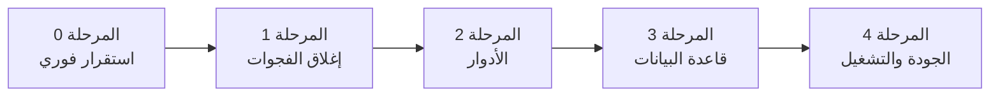

# خارطة الطريق الموصى بها — منصة كفاءات

> توصيات فقط (لا إصلاحات مطبّقة) — التاريخ: **2026-07-20**.
> مبنية على نتائج `SYSTEM_OVERVIEW.md`، `DATABASE_SCHEMA.md`، `USER_ROLES_AND_PERMISSIONS.md`، `CURRENT_FEATURES.md`، `BUG_AUDIT.md`.

الأولوية: 🔴 عاجل · 🟠 مهم · 🟡 لاحقاً. الجهد تقديري: S (ساعات) · M (أيام) · L (أسبوع+).

---

## المرحلة 0 — استقرار فوري (🔴)

| # | الإجراء | يعالج | جهد |
| --- | --- | --- | --- |
| 0.1 | إصلاح تحويل النبذة في `TrainingProgramExtrasSupport.php:28` (تطبيع مصفوفة TipTap قبل `(string)`) | BUG و1 | S |
| 0.2 | إصلاح مجموعة الاختبارات: استبدال الأدوار المحذوفة (`trainee`→`beneficiary`، أدوار الموظفين القديمة→`staff` + منح صلاحيات) في مصانع/مساعدات الاختبار | BUG ه2 | M |
| 0.3 | إعادة تشغيل الاختبارات حتى تصبح خضراء لاستعادة شبكة الأمان قبل أي تطوير جديد | ه2 | S |
| 0.4 | تدوير مفتاح Resend وإزالته من شجرة العمل؛ تصحيح `.env` المحلي (`MAIL_MAILER=log`) | BUG س1/س2 | S |

> **مبدأ:** لا تبدأ ميزات جديدة قبل أن تصبح الاختبارات خضراء (0.2–0.3) لأنها تحجب حالياً أي انحدار.

---

## المرحلة 1 — إغلاق فجوات الوظائف (🔴/🟠)

| # | الإجراء | يعالج | جهد |
| --- | --- | --- | --- |
| 1.1 | تحديد مصير مركز خصوصية المستفيد: إمّا ربط المتحكمات بمسارات `/portal/privacy/*` (وصول/تصحيح/تصدير/إلغاء) وتفعيل الواجهة، أو حذفها كـ كود ميت | BUG م1 | M |
| 1.2 | إن فُعّلت (1.1): اختبارات E2E لتدفقات الوصول/التصحيح/التصدير + تنزيل ZIP الآمن | م1 | M |
| 1.3 | إدارة محتوى صفحة الشروط والأحكام (أو توثيق أنها ثابتة عمداً) | BUG م2 | S |

---

## المرحلة 2 — تصلّب المصادقة والأدوار (🟠)

| # | الإجراء | يعالج | جهد |
| --- | --- | --- | --- |
| 2.1 | خطة توحيد نظام الأدوار: اعتماد Spatie مصدراً وحيداً وإهمال `users.role_type` تدريجياً (طبقة توافق + هجرة بيانات) | BUG ه1 | L |
| 2.2 | توحيد تفضيلات الإشعارات في مصدر واحد (`notification_settings`) وإهمال `notify_email` | BUG و2 | M |
| 2.3 | اختبارات تفويض شاملة للأدوار الأربعة + مصفوفة صلاحيات الموظفين | ه1 | M |

---

## المرحلة 3 — سلامة قاعدة البيانات وبيئة التشغيل (🟠)

| # | الإجراء | يعالج | جهد |
| --- | --- | --- | --- |
| 3.1 | مطابقة بيئة التطوير مع الإنتاج: تشغيل PostgreSQL محلياً (Docker) بدل sqlite لضمان تطابق الأنواع | BUG د1 | M |
| 3.2 | التأكد أن أعمدة JSON من نوع `jsonb` في Postgres، وإضافة فهارس GIN عند الحاجة | BUG د2 | M |
| 3.3 | تنظيف الأعمدة المتداخلة/القديمة بعد التحقق: `profiles.cv_path`، `users.name`، توحيد قياس الأخطاء | BUG د3 | M |
| 3.4 | حذف ملفات هجرات الجداول القديمة أو أرشفتها (path_courses / user_course_progress) | د3 | S |
| 3.5 | فحص N+1 عبر `Model::preventLazyLoading()` في التطوير ومراجعة الاستعلامات في اللوحات والقوائم | جودة | M |

---

## المرحلة 4 — تحسينات الجودة والتشغيل (🟡)

| # | الإجراء | جهد |
| --- | --- | --- |
| 4.1 | تحديث `README.md` ليعكس Laravel 13 / Tailwind 4 (Vite) / نموذج البرامج الحالي | S |
| 4.2 | إعادة تسمية جدول/نموذج الإشعارات لإزالة الالتباس (`in_app_notifications` ↔ `InboxNotification`) أو توثيقه صراحةً | S |
| 4.3 | تفعيل CI (GitHub Actions) يشغّل `pint --test` + `php artisan test` + `composer validate` على كل PR | M |
| 4.4 | مراقبة الأمن: مراجعة رؤوس CSP/HSTS في الإنتاج، والتأكد من `APP_DEBUG=false` و`SESSION_SECURE_COOKIE=true` و`FORCE_HTTPS=true` | S |
| 4.5 | توثيق تشغيلي لمنظومة الاحتفاظ (Retention) والجدولة المطلوبة لتشغيل عمليات الحذف الدورية | M |

---

## تسلسل مقترح موجز

**قاعدة ذهبية:** كل مرحلة تُغلق باختبارات خضراء ومراجعة، مع الالتزام بمبدأ عدم إدخال ميزات جديدة فوق قاعدة اختبارات غير موثوقة.

