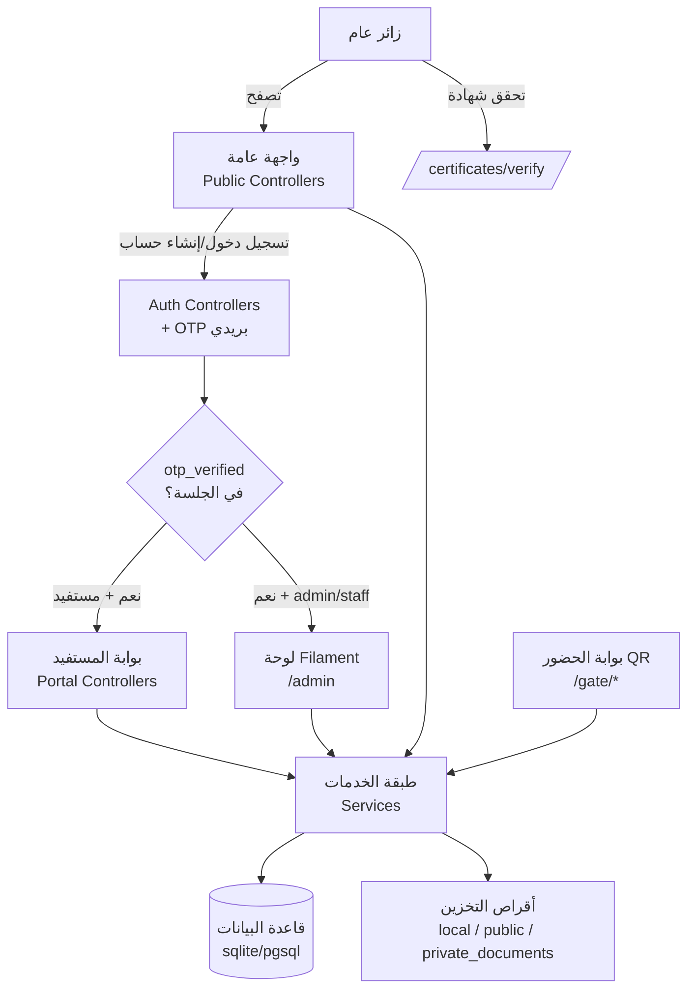

<div dir="rtl">

# نظرة عامة على النظام — منصة كفاءات

> تقرير تدقيق تقني (قراءة فقط). التاريخ: **2026-07-20**.
> جميع المعلومات مبنية على الكود الفعلي ومخطط قاعدة البيانات في المستودع، وليست على وثائق تسويقية.

---

## 1. الغرض من المنصة

منصة إدارية عربية (RTL) لجهة **كفاءات** تغطي دورة حياة المستفيد: التسجيل، إدارة البرامج التدريبية والمسارات التعليمية والفرص التطوعية، نظام الموافقات، الحضور (QR / رمز حي)، إصدار الشهادات والتحقق منها، بوابة مستفيد، لوحة إدارة (Filament)، بالإضافة إلى منظومة **خصوصية وحوكمة بيانات** متقدمة (طلبات وصول/تصحيح/حذف/تصدير، سياسات احتفاظ، سجلات تدقيق وأمن).

---

## 2. المكدس التقني والإصدارات

المصدر: `composer.json`، `composer.lock`، `package.json`.

| الطبقة | التقنية | الإصدار الفعلي (من `composer.lock`) |
| --- | --- | --- |
| اللغة | PHP | `^8.4` (بيئة التطوير: 8.4.10) |
| الإطار | Laravel Framework | **v13.7.0** |
| لوحة الإدارة | Filament | **v5.6.1** |
| الواجهة التفاعلية | Livewire | **v4.2.4** (تبعية عبر Filament) |
| CSS | Tailwind CSS | **v4.x** عبر `@tailwindcss/vite` |
| أداة البناء | Vite | **v8.x** + `laravel-vite-plugin` v3 |
| الصلاحيات | spatie/laravel-permission | **7.4.1** |
| سجل النشاط | spatie/laravel-activitylog | **4.12.3** |
| PDF (شهادات) | barryvdh/laravel-dompdf | **v3.1.2** |
| PDF (سير ذاتية عربية) | mpdf/mpdf | **v8.3.1** |
| Excel | maatwebsite/excel | **3.1.68** |
| QR | endroid/qr-code | **6.1.3** |
| تنقية HTML | mews/purifier | **3.4.4** |
| البريد | resend/resend-laravel | **v1.4.0** |
| REPL | laravel/tinker | **v3.0.2** |
| الاختبارات | phpunit/phpunit | **12.5.23** (+ collision, mockery, faker, pail, pint) |

**امتدادات PHP المطلوبة:** `ext-gd`, `ext-intl`, `ext-pdo_pgsql`, `ext-pgsql`, `ext-zip`.

### قاعدة البيانات
- الإعداد الافتراضي في `config/database.php:20` هو **`sqlite`** (`env('DB_CONNECTION', 'sqlite')`).
- بيئة الإنتاج المقصودة **PostgreSQL** (`.env.example:32` → `DB_CONNECTION=pgsql`, قاعدة `kafaat`).
- توجد قاعدة تطوير محلية فعلية: `database/database.sqlite` (~925KB، مُهجَّرة بالكامل — انظر `DATABASE_SCHEMA.md`).

> ⚠️ **انحراف توثيقي:** `README.md:109-112` يذكر "Laravel 11 / Tailwind CDN / PostgreSQL عبر Supabase". الواقع: **Laravel 13**، **Tailwind 4 عبر Vite** (لا CDN)، والقاعدة الافتراضية `sqlite`. الـ README قديم ولا يعكس الحالة الحالية.

---

## 3. بنية المشروع (المجلدات الرئيسية)

```
kafaat_platform/
├── app/
│   ├── Console/           أوامر artisan المخصصة
│   ├── Data/              كائنات نقل بيانات (DTO)
│   ├── Enums/             47 تعداد (حالات، أنواع، أدوار مجال)
│   ├── Exceptions/        استثناءات مخصصة
│   ├── Exports/           صادرات Excel (maatwebsite)
│   ├── Filament/          لوحة الإدارة: Resources, Pages, Widgets, Actions, Concerns, Forms
│   ├── Http/
│   │   ├── Controllers/   Public / Portal / Admin / Auth / Gate
│   │   ├── Middleware/    9 وسائط مخصصة (أمن، OTP، بوابة، خصوصية)
│   │   └── Requests/      طلبات التحقق (Admin/Auth/Portal)
│   ├── Inbox/             منطق صندوق الإشعارات الداخلي
│   ├── Jobs/              مهام الطابور
│   ├── Models/            ~57 نموذج Eloquent
│   ├── Notifications/     إشعارات البريد/القاعدة
│   ├── Policies/          26 Policy للتفويض
│   ├── Providers/         AppServiceProvider + Filament/AdminPanelProvider
│   ├── Rules/             قواعد تحقق مخصصة
│   ├── Services/          طبقة الخدمات (المنطق الأساسي) — انظر أدناه
│   ├── Support/           فئات مساعدة (Rich content, PublicDiskPath, ...)
│   └── helpers.php        دوال عامة
├── routes/
│   ├── web.php            كل مسارات الويب (لا يوجد api.php)
│   └── console.php        أوامر/جدولة
├── database/
│   ├── migrations/        95 ملف هجرة
│   ├── seeders/           ~40 seeder
│   ├── factories/         مصانع الاختبار
│   └── database.sqlite    قاعدة تطوير محلية
├── resources/             views (Blade), css, js
├── config/                إعدادات (28 ملف)
├── tests/                 Unit + Feature (Pest/PHPUnit)
├── docs/                  توثيق (بما فيه هذا التقرير)
├── lang/                  ترجمات
├── public/                نقطة الدخول والأصول المبنية
├── railway/ , railpack.json , railway.json   إعداد النشر على Railway
├── emergency-fallback/    صفحات/أصول احتياطية للطوارئ
├── scripts/               نصوص تشغيلية
└── postgres/ (ملف)        مخرجات/أداة PostgreSQL محلية
```

### طبقة الخدمات `app/Services/` (أبرز المجالات)
- **Rbac/** — `RbacCatalog`, `RbacService`, `StaffPermissionService`, `PermissionMatrixCatalog` (نموذج الأدوار الأربعة).
- **Privacy/** — منظومة كاملة: `PrivacyRequestService`, `Export/` (تصدير بيانات شخصية ZIP)، `Deletion/` (14 handler حذف/إخفاء هوية)، `Retention/` (محرك سياسات الاحتفاظ + handlers).
- **Identity/** — `IdentityNumberService` (تشفير + HMAC lookup)، `SaudiPhoneService`, `PersonNameService`.
- **Documents/** — تخزين السير الذاتية على قرص خاص + التحقق من الملفات.
- **CandidatePool/** — قاعدة المرشحين والموافقات.
- **Audit/**, **Security/** — سجلات التدقيق والأمن + إخفاء البيانات الحساسة.
- **Portal/**, **Inbox/**, **News/**, **Operations/**, **Support/** — منطق البوابة والإشعارات والأخبار والصحة التشغيلية والدعم.

---

## 4. المعمارية عالية المستوى



- **نمط معماري:** MVC + **طبقة خدمات** واضحة (المنطق خارج المتحكمات)، مع **Policies** للتفويض و**Enums** غنية للحالات.
- **ثلاث واجهات:** (1) موقع عام Blade، (2) بوابة مستفيد Blade، (3) لوحة إدارة Filament — كلها على الحارس `web` ونفس جدول `users`.
- **مصادقة:** جلسة + **OTP بريدي إلزامي في كل دخول** (لا يُكتفى بـ `email_verified_at`) عبر `EnsureOtpVerified` (`app/Http/Middleware/EnsureOtpVerified.php`).
- **الطابور:** `database` في الإنتاج، `sync` محلياً. **الجدولة** عبر `routes/console.php`.
- **النشر:** Railway (خلف بروكسي عكسي موثوق — `bootstrap/app.php`).

---

## 5. نتيجة تشغيل الاختبارات

الأمر: `php artisan test` (بتاريخ التقرير).

| النتيجة | العدد |
| --- | --- |
| ناجحة (Passed) | **253** |
| فاشلة (Failed) | **69** |
| متجاوَزة (Skipped) | **27** |
| إجمالي التأكيدات | 723 |
| المدة | ~23 ثانية |

**تحليل الفشل:** **67 من 69** فشلاً سببها `RoleDoesNotExist` — اختبارات ما زالت تُسند أدواراً **محذوفة** بعد إعادة هيكلة الأدوار (`trainee` ×54، `programs_management`/أدوار موظفين قديمة ×13). هذه **ديون اختبارات** (test debt) وليست أعطالاً في التطبيق. **العطلان المتبقيان** حقيقيان: استثناء `Array to string conversion` في نموذج إنشاء/تعديل البرنامج التدريبي — التفاصيل في `BUG_AUDIT.md` (`app/Support/TrainingProgramExtrasSupport.php:28`).

**فحوصات أخرى:** جميع الهجرات في حالة `Ran` (`php artisan migrate:status`). أدوات متاحة: `laravel/pint` (تنسيق)، `composer validate`.

---

## 6. مراجع سريعة

- التفاصيل الكاملة للمخطط: `docs/DATABASE_SCHEMA.md`
- الأدوار والصلاحيات: `docs/USER_ROLES_AND_PERMISSIONS.md`
- الميزات المكتملة/الناقصة: `docs/CURRENT_FEATURES.md`
- تصنيف الأخطاء: `docs/BUG_AUDIT.md`
- خارطة الطريق: `docs/RECOMMENDED_ROADMAP.md`

</div>
