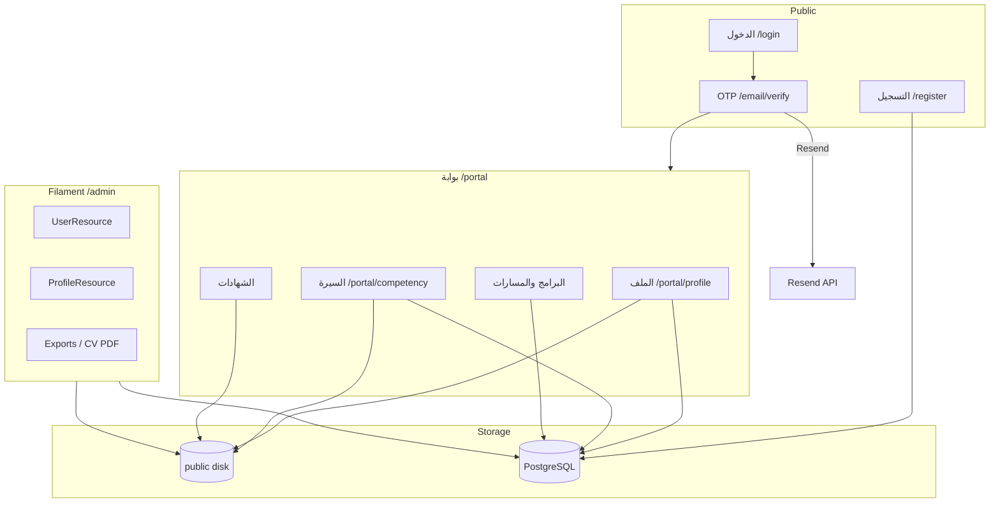

# تدفق البيانات الحالي

> توثيق المرحلة 1 — بدون تعديل سلوك.

## نظرة عامة

## 1. التسجيل

1. المستخدم يرسل `name`, `email`, `password` → `RegisterController@store`.
2. يُنشأ `users` (role_type=`beneficiary`, is_active=true) + `profiles` فارغ.
3. يُعيَّن دور Spatie `trainee`.
4. `Auth::login` → حدث Login → OTP يُرسل + `otp_verified=false`.
5. `UserActivityLogger::logAccountCreated`.

**بيانات شخصية تُجمع:** الاسم (حقل واحد)، البريد، كلمة المرور (م hashed).

**لا يوجد:** إقرار خصوصية، رقم هوية، تاريخ ميلاد إلزامي.

## 2. تسجيل الدخول و OTP

1. `LoginController@store` → `Auth::attempt` → `session()->regenerate()`.
2. Login listener: `otp_verified=false` + `EmailVerificationCodeService::sendCode`.
3. الرمز: `random_int` → `Hash::make` في `email_verification_codes.code_hash`.
4. إشعار `VerifyEmailCode` عبر Resend.
5. بعد التحقق: `otp_verified=true` في الجلسة + `email_verified_at` (أول مرة).
6. Middleware `otp.verified` يحمي portal وتحميل الشهادات.

## 3. الملف الشخصي

1. GET `/portal/profile` — يعرض name, phone, city, job_title, avatar.
2. PATCH — يحدّث `users` + `profiles`؛ الصورة → `Storage::disk('public')->store('avatars')`.
3. `UserActivityLogger::logProfileUpdated`.

## 4. السيرة الذاتية (CV)

1. أقسام structured → `profiles.cv_sections` JSON.
2. ملف مرفق → `profiles.cv_path` على قرص `public/cv/`.
3. PDF export → `PortalCompetencyExportController` → mPDF stream (بيانات الملف + JSON).
4. Admin CV PDF → `BeneficiaryCvPdfController` (يتطلب auth + otp).

## 5. البرامج والحضور

1. التسجيل العام → جداول registrations (pending افتراضياً).
2. الموافقة من Filament → إشعارات + حضور + شهادة محتملة.
3. حضور عن بُعد: جلسة live + self check-in من البوابة.
4. حضور حضوري: QR token على `program_registrations`.

## 6. الشهادات

1. الإصدار من Filament → `certificates` + PDF على `public`.
2. التحميل: `CertificateDownloadController` + `CertificatePolicy`.
3. التحقق العام `/certificates/verify/{code}` — **يعرض اسم المستفيد الكامل** بدون auth.

## 7. البريد

- OTP، إشعارات البرامج، موافقات/رفض → Resend.
- `email_logs` يسجل بعض الإرسالات الإدارية.

## 8. الإدارة و exports

- Filament resources تقرأ/تعدّل users, profiles, registrations.
- Excel exports عبر Maatwebsite — قد تتضمن بيانات شخصية حسب Resource.
- `ProfilePolicy::export` يتطلب `roles.view`.

## 9. الجلسات

- `sessions` table: user_id, ip_address, user_agent, payload.
- لا retention policy مبرمجة.
